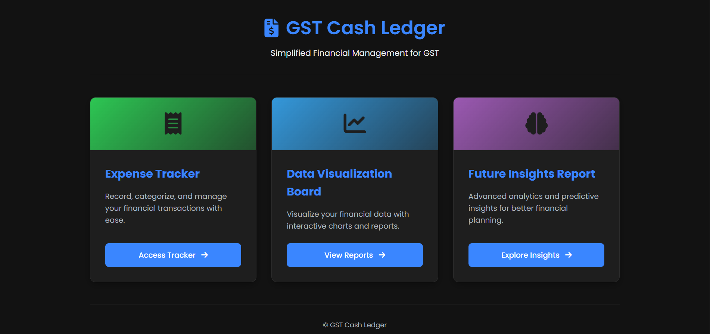

<!-- # GST Cash Ledger App
 
# GST Expense Tracker & Business Dashboard

This is a web-based **expense tracker and analytics dashboard** built with **Chart.js**, designed for both **individual users** and **business professionals**. It allows users to manage income and expenses, track **GST**, and visualize financial data through interactive charts.

---

## 📊 Features

- **Add Income & Expense Transactions**
- **Filter by Time Period**: View data for current month, last quarter, year, or all-time
- **Automatic GST Calculation** by category (e.g., Electronics 18%, Food 5%, etc.)
- **Interactive Visualizations**:
  - Bar chart: Income vs Expenses
  - Doughnut chart: Expense Category Breakdown
  - Line chart: Balance Over Time
  - Horizontal bar chart: GST Paid by Category
- **LocalStorage Based**: All data is saved in the browser
- **No Data? No Problem!**: Smart fallback messaging on empty dashboards

---

## 🛠 Tech Stack

- **HTML, CSS, JavaScript**
- **Chart.js** for data visualization
- **LocalStorage** for offline data persistence

---
 -->

# GST Cash Ledger and Expense Prediction System

A modern web application designed to help individuals and small businesses **track expenses, manage income, calculate GST liabilities**, and visualize financial patterns over time. It includes **interactive charts**, intelligent **monthly insights**, and even **predictive forecasting** to assist with future planning.

---

## 🚀 Features

- **Expense & Income Tracker**: Add transactions with category, GST type, and timestamps.
- **Dashboard Visualizations**: Interactive charts for cash flow, expense categories, and GST trends.
- **Downloadable Reports**: Export your full transaction history as CSV for records or audits.
- **Flexible Date-Time Selection**: Add entries for current or past dates.
- **GST Calculation**: Auto-computes GST liability based on category-specific rates.
- **ML Visualizer (Forecasting Module)**:
  - Predicts future income, expenses, and GST liability for the next 3 months
  - Highlights top expense category and income-to-expense health ratio

---

## Screenshots




---

## 📁 Project Structure

```bash
├── index.html             # Main landing page
├── style.css              # Stylesheet for layout and design
├── app.js                 # Handles transactions, UI interaction, and storage
├── ml-visualizer.js       # ML-style predictions and insight generation (forecasts, ratios, top categories)
├── charts.js              # Chart.js config for visualization components
├── data/
│   └── sample.csv         # Example exported CSV
├── assets/
│   └── icons, fonts, etc.
└── README.md              # You're here!
